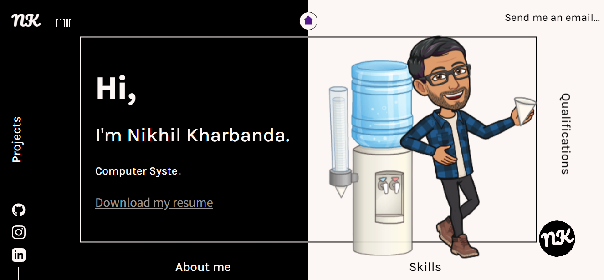
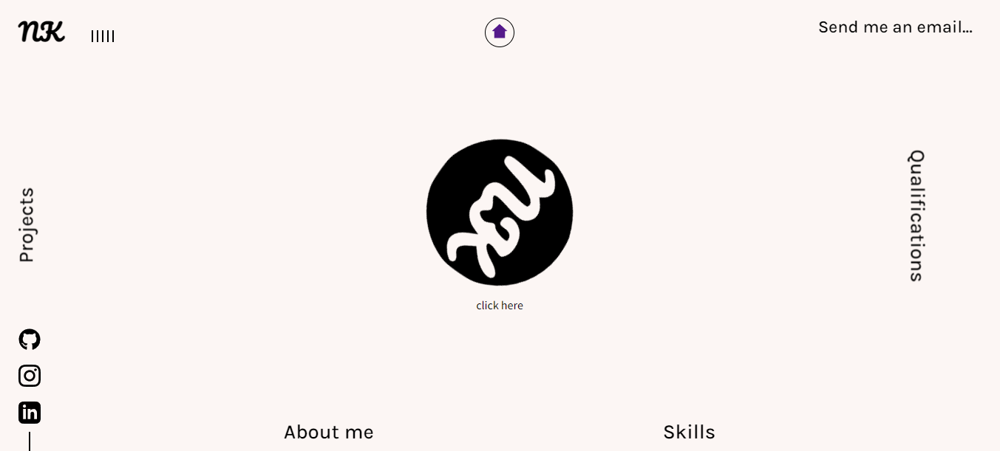
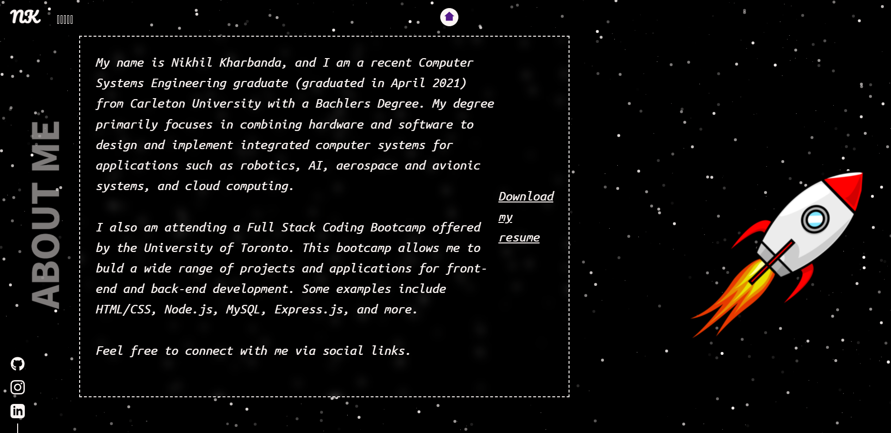
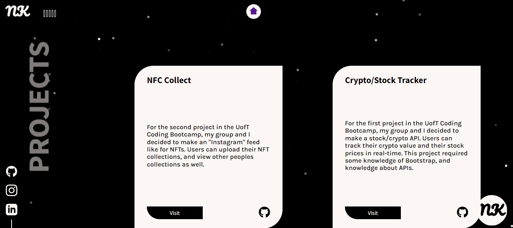
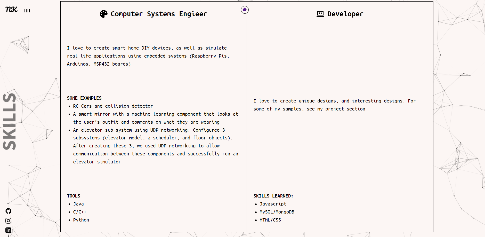

<h1 align="center">React Portfolio </h1>

    

## Description
  For this project, I had used react to make a portfolio

## Table of Contents
  - [Description](#description)
  - [Installation](#installation)
  - [License](#license)
  - [Contributing](#contributing)
  - [Link](#Link)
  - [Images](#images)  

## Purpose
  To make a professional portfolio using React
  
## Installation

### Clone
  git clone https://github.com/nikhil-kharbanda/PortfolioReact.git

### Install Dependencies
All NPM packages required for this application (Express, Compression, Mongoose, Lite-Server and Morgan) are already listed as dependencies in the package.json file. Run the command 'npm i' command in your terminal at the root directory level to install the packages.
Ensure you have Node.js installed on your machine. The application will be invoked by entering node server.js in the command line.

### Running application
Run the appliaation using "npm run". You will then see the application running on port 3000! in the console. You can then view the app on http://localhost:3000/.

## Contributing
  NA

## Link
  https://personalportfolio-nikhil.herokuapp.com/  
  (NOTE: Unable to push to GitPages, was rec to push to Heroku)

## Images
  
  
  
  
  
  

## About the developer 
  nikhil-kharbanda  
  nikhil_kharbanda@hotmail.com

  
